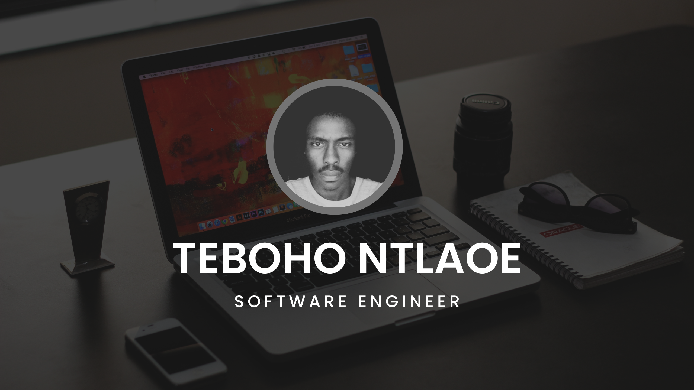

# My Personal Bio

## About Me
Hello! My name is Teboho. I am a participant in the Africa Code Academy Engineering Residency Program 2024.

## Background
- **Name:** Teboho Ntlaloe
- **Location:** Maseru, Lesotho
- **Education:** Graduate
- **Skills:** APIs, Game Development, Web Development, CI/CD, Version Control

## Journey
### Early Life
I grew playing arcade and console games. I played so many games that I eventually took interest in being 
able to create my own. That is where my software engineering journey started. I looked some of the creators 
behind my favourite games such as Tetris, Pacman, Doom, Metalgear Solid and others.

### Education and Career
I enrolled at Botho University in 2017 and graduated in 2021. I have no professional career 
in the form of having a full time job but I have done 
some work freelancing, I have been able to publish 3 websites and one mobile app throughout my freelancing career.

### Goals
My goal is to have job and work in an organization with other developers. Freelancing is great but it doesn't 
have a great market. It's hard to get a client and even harder to retain one.

## Projects
### Project 1
Created a mobile designed to teach kids the basics of the Sesotho Language starting with basic words, 
vowels and consonents. 

### Project 2
Create a travel booking application for a travel agency.

## Contact
- **Email:** [ntlal0e182@gmail.com](mailto:ntlal0e182@gmail.com)
- **LinkedIn:** [Teboho Ntlaloe](https://www.linkedin.com/in/teboho-ntlaloe-189387199/)
- **GitHub:** [LordNtlaloe](https://github.com/LordNtlaloe)

---

# Alternate Mult-Page Template

## Sections

- [About Me](about.md)
- [Skills](skills.md)
- [Projects](projects/index.md)
- [Contact](contact.md)
